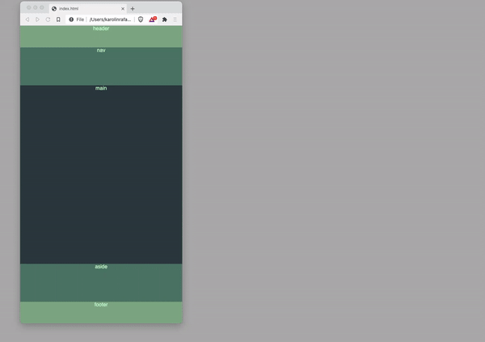
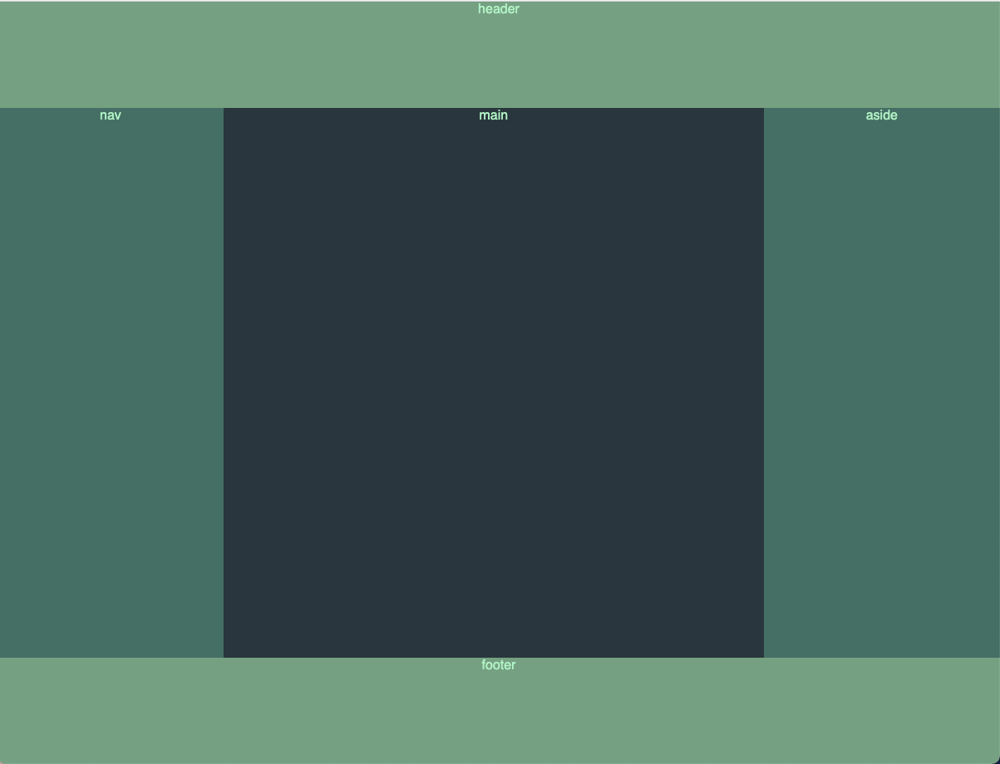
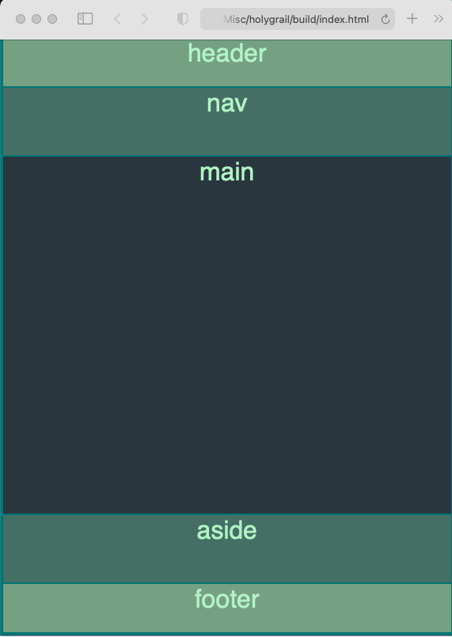
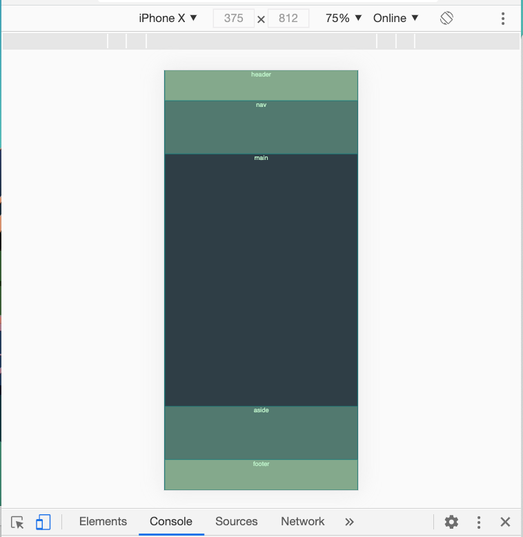

# Responsive Layouts & Mobile First

Currently, many people will visit a webiste on mobile, first and more often than on a desktop. Therefore it is important to consider the user experience using mobile.

Layouts that work on desktop, often don't work on mobile. Mobile devices are smaller and the ratio of width/height is typically higher.

## `@media` queries

CSS allows us to write a separate set of rules depending on screen width/device.  It is easier to build a small size website first and then add a bigger site.


## Demo Simple Media Query



## Build Holy Grail Layout

A common layout is called Holy Grail. It used to be quite difficult to achieve, but modern CSS (eg. Flexbox, grid (not covered today)) make it a lot easier.

It has a header along the top, then the main content is in the center, nav can be on the left or right, and an aside is set aside for things like advertisements. Finally, a footer is along the bottom.

**Wide/Desktop view**


**Narrow/Mobile view**


Let's build it together


Navigate to this repo's folder on your computer

- `mkdir css-layout`
- `cd css-layout`
- `touch index.html main.css`
- open with your text editor
- add html boilerplate
- link your css: `<link rel="stylesheet" href="./main.css">`
- open the index.html in your browser

Our site will have 6 main components

- `div` with a class of `container` and inside of this div (put the name of the element inside, to help in the build)
  - `header`
  - `nav`
  - `main`
  - `aside`
  - `footer`

Then let's add to the `main.css`

```css
body {
  background-color: darkseagreen;
}

```


**index.html** so far:

```html
<!DOCTYPE html>
<html lang="en" dir="ltr">
  <head>
    <meta charset="utf-8">
    <title>Holy Grail</title>
    <link rel="stylesheet" href="./main.css">
  </head>
  <body>
    <div class="container">
      <header>header</header>
      <nav>nav</nav>
      <main>main</main>
      <aside>aside</aside>
      <footer>footer</footer>
    </div>
  </body>
</html>
```

**Confirm success:**


It would be nice, to work with a dark theme of colors. But hex colors are hard to remember. We can create CSS variables and use them in our build. Let's copy and paste this to the top of our `main.css`:

```CSS
:root {
  --pale-sage: #BFF4CB;
  --sage: #84A98C;
  --dusty-emerald: #52796f;
  --deep-emerald: #354F52;
  --night-forrest: #2F3E46;
}
```

Let's see it in action by adding some style to our body:

```CSS
body {
  margin: 0;
  font-family: sans-serif;
  text-align: center;
  background-color: var(--night-forrest);
  color: var(--pale-sage);
}
```

and let's add a universal rule to help guide our build
```CSS
* {
  border: 1px solid teal;
}
```

Let's make a layout for mobile:

```CSS
.container {
  display: flex;
  min-height: 100vh;
  flex-direction: column;
  justify-content: space-between;
}
```

It's going to look a bit odd with just the container styled. Let's add a bit more styling to make it look like our mockup:

```CSS
main {
  min-height: 60vh;
  flex-grow: 5;
}

aside, nav {
  background-color: var(--dusty-emerald);
  flex-grow: 2;
}

footer, header {
  background-color: var(--sage);
  flex-grow:1;
}

```

We can now open up dev tools and click on the mobile view:


**View:**



**IMPORTANT** - browsers can behave a bit differently, it's ok if your view is not 100% perfectly aligned with these screenhots.

Click on the blue mobile icon to return to regular view.


## Media Queries

So we made a view for mobile, but this doesn't look so great in the browser. Let's add a media query and change the layout to the holy grail layout.


```CSS
@media (min-width: 600px) {
  .container {
    flex-direction: row;
  }
}
```

Let's finish up our layout:

```CSS
@media only screen and (min-width: 200px) {
  .container {
    flex-direction: row;
    flex-wrap: wrap;
    /* add for debugging if you are not sure your media query is being triggered */
    /* color: lemonchiffon; */
  }
  main {
    max-width: 60%;
  }
  header, footer {
    width: 100%;
  }
}

```

#### Bonus

We can, inside our `main` element add some text*

```html
<section>
  <p>lorem</p>
<section>
```
* type `lorem` and let it autofill with some lorem text

Create a few of these sections, so that you can see what happens when the content of main is larger than the height of our viewport.


We can also move the nav to the bottom, so our user can get to navigation more easily when they are done scrolling through our content.

```CSS
nav, footer {
  order: 2;
}
```

**Finished CSS:**

```CSS
:root {
  --pale-sage: #BFF4CB;
  --sage: #84A98C;
  --dusty-emerald: #52796f;
  --deep-emerald: #354F52;
  --night-forrest: #2F3E46;
}

* {
  border: 1px solid teal;
}

body {
  margin: 0;
  font-family: sans-serif;
  text-align: center;
  background-color: var(--night-forrest);
  color: var(--pale-sage);
}

.container {
  display: flex;
  min-height: 100vh;
  flex-direction: column;
  justify-content: space-between;
}


main {
  min-height: 60vh;
  flex-grow: 5;
}

aside, nav {
  background-color: var(--dusty-emerald);
  flex-grow: 2;
}

footer, header {
  background-color: var(--sage);
  flex-grow:1;
}


@media (min-width: 600px) {
  .container {
    flex-direction: row;
    flex-wrap: wrap;
    /* color: lemonchiffon; */
  }
  main {
    max-width: 60%;
  }
  header, footer {
    width: 100%;
  }
}

```
